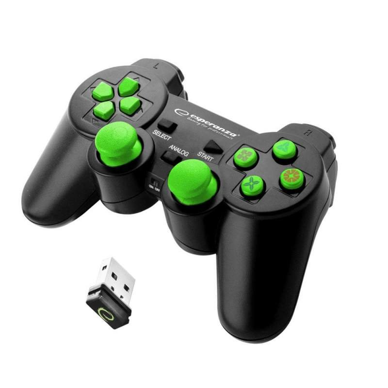

<!-- {"s_msg":"this file was automatically generated","s_by":"f_generate_markdown.module.js","s_ts_created":"Mon Apr 01 2024 02:07:49 GMT+0200 (Central European Summer Time)","n_ts_created":1711930069260} -->

# usb hid
## import stuff
```javascript
import { 
    f_update_o_input_device,
    a_o_input_device
 } from "./mod.js";

```
## get a device
very few devices are existing yet but reverse engeneering your device is pretty simple, at least
the reading from the device part
an existing device is for example this cheap wireless controller
Bus 003 Device 025: ID 045e:028e Microsoft Corp. Xbox360 Controller

```javascript
            let n_id_vendor = 0x045e
            let n_id_product = 0x028e
            
            let o_input_device = a_o_input_device.find(
                o=>{
                    return (
                        o.n_id_vendor == n_id_vendor
                        && o.n_id_product == n_id_product
                    )
                }
            );
            f_update_o_input_device(
                o_input_device, 
                new Uint8Array( 
                    // this data usually comes from reading the device->interface->endpoint 'in' 0x81
                    // at the moment you have to see for yourself how to get this data
                    [0,20,0,0,0,0,0,0,0,0,0,0,0,0,0,0,0,0,0,0]
                )
            );
            // you can find a value by a string
            let n_signed_normalized_value__d_pad_up = o_input_device?.a_o_input_sensor.find(o=>o.s_name == 'd_pad_up')
            // 1. // pressed
            let n_signed_normalized_value__l3 = o_input_device?.a_o_input_sensor.find(o=>o.s_name == 'l3')
            // 0. // not pressed
            let n_signed_normalized_value__x_button = o_input_device?.a_o_input_sensor.find(o=>o.s_name == 'x_button')
            // 1. // pressed
            let n_signed_normalized_value__l2_intensity = o_input_device?.a_o_input_sensor.find(o=>o.s_name == 'l2_intensity')
            // 0.2 // how strong it is pressed
            let n_signed_normalized_value__left_x_axis = o_input_device?.a_o_input_sensor.find(o=>o.s_name == 'left_x_axis')
            // -0.8 // almost moved fully 
            let n_signed_normalized_value__right_y_axis = o_input_device?.a_o_input_sensor.find(o=>o.s_name == 'right_y_axis')
            // 0.35 // slightly moved 

```